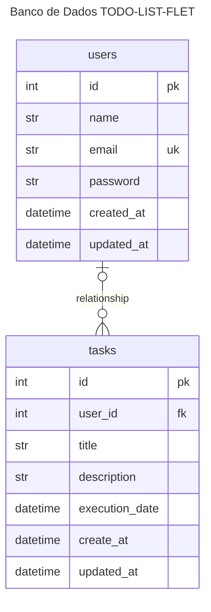

# Banco de Dados

Para esta problemática, estaremos usando um banco de dados SQLite simples.

As tabelas necessárias se encontram no diagrama a baixo:

```mermaid
---
title: Banco de Dados TODO-LIST-FLET
---
erDiagram
    users{
        int id pk
        str name
        str email uk
        str password
        datetime created_at
        datetime updated_at 
    }
    tasks{
        int id pk
        int user_id fk
        str title
        str description
        datetime execution_date
        datetime create_at
        datetime updated_at 
    }
    users o|--o{ tasks: relationship

```
